# ShelfDESK

LMS_Flask is a Library Management System built using Flask, a lightweight WSGI web application framework in Python. This project allows users to manage books, members, and transactions in a library.

## Table of Contents

* [Introduction](#introduction)
* [Features](#features)
* [Tech Stack](#tech-stack)
* [Project Structure](#project-structure)
* [Installation](#installation)
* [Usage](#usage)
* [Home Page](#home-page)
* [Database Schema](#database-schema)
* [Functionalities](#functionalities)
  * [Books](#books)
  * [Members](#members)
  * [Transactions](#transactions)
* [Future Enhancements](#future-enhancements)
* [Contributing](#contributing)
* [License](#license)

## Features ⭐

* **Book Management:** Add, edit, delete, and view books with details like title, author, ISBN, genre, etc.
* **Membership Management:** Create, edit, delete, and view member profiles.
* **Transaction Management:** Issue and return books, track borrowing history.
* **Invoicinging:** Generate invoice of issued books for members.
* **Search and Filter:** Search for books by title or author, and filter by genre.
* **Print Library Card:** Generate and print library cards for members.
* **Statistics:** Display the total number of books, members, and transactions.
* **Dark Mode:** Toggle between light and dark themes.
* **Responsive Design:** Mobile-friendly interface.

## Tech Stack 🛠️

* **Frontend:** HTML, CSS (Bootstrap) , JavaScript
* **Backend:** Python (Flask framework)
* **Database:** PostgreSQL (can be replaced with MariaDB or MySQL)

## Project Structure
Explore the organized folder structure that makes ShelfDESK an efficient and easily maintainable application:

```bash
LMS_Flask/
├── pycache/
├── app.py               # Main Flask app
├── books_api.py         # API endpoints for books
├── config.py            # Configuration file
├── delete_all_tables.py # Script for clearing all tables
├── env/                 # Virtual environment
├── LICENSE              # Project license details
├── models.py            # Database models
├── README.md            # Project documentation
├── requirements.txt     # Project dependencies
├── static/              # Static files (CSS, JS, images)
│   ├── css/
│   ├── js/
│   └── images/
├── templates/           # Jinja-based HTML templates
│   ├── base.html
│   ├── index.html
│   ├── book_details.html
│   ├── member_details.html
│   └── transaction.html
└── tests/               # Unit tests for the application
    ├── test_app.py
    ├── test_books_api.py
    └── test_models.py
```

## Installation

1. Clone the repository:
    ```sh
    git clone https://github.com/yourusername/LMS_Flask.git
    cd LMS_Flask
    ```

2. Create a virtual environment and activate it:
    ```sh
    python3 -m venv env
    source env/bin/activate
    ```

3. Install the required dependencies:
    ```sh
    pip install -r requirements.txt
    ```

4. Set up the database:
    ```sh
    python app.py
    ```

## Usage 🚀

1. Run the Flask application:
    ```sh
    flask run
    ```

2. Open your web browser and go to `http://127.0.0.1:5000/` to access the application.

## Home Page
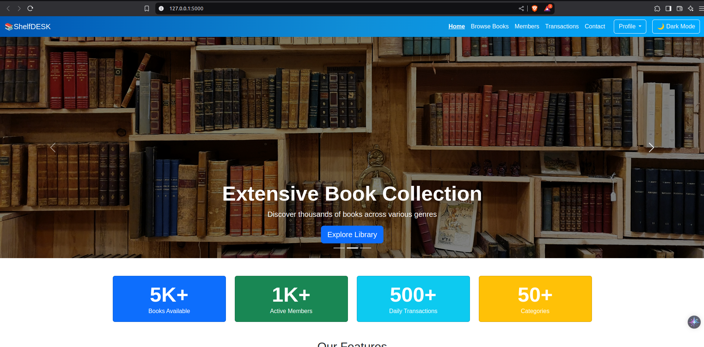
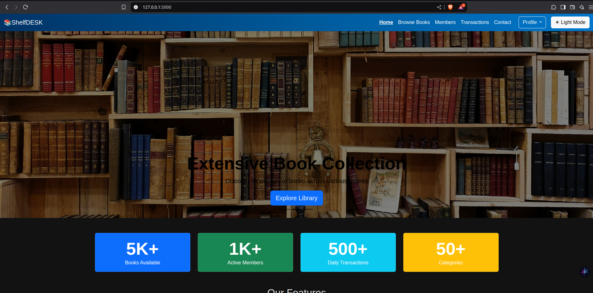
The home page of the LMS_Flask application provides an overview of the library management system. It includes the following sections:
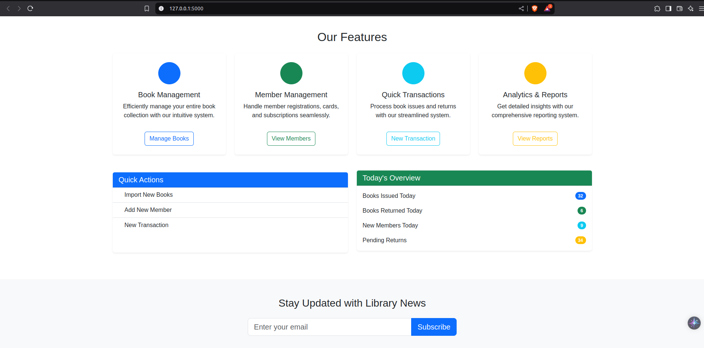
- **Welcome Message**: A brief introduction to the library management system.
- **Navigation Links**: Links to different sections of the application such as Books, Members, and Transactions.
- **Statistics**: Displays the total number of books, members, and transactions in the library.
- **Recent Activities**: Shows the latest transactions, including borrowed and returned books.

The home page is designed to give users a quick overview of the library's status and easy access to the main functionalities of the system.

## Database Schema 🗄️

The database consists of the following tables:

* **Book:** Stores book details (title, author, ISBN, genre, etc.).
* **Member:** Stores member information (name, contact details, membership type, etc.).
* **Transaction:** Tracks book borrowing/returning activities (member ID, book ID, issue date, return date, status).

## Functionalities

### Books

- **Add Book**: Allows the user to add a new book to the library.
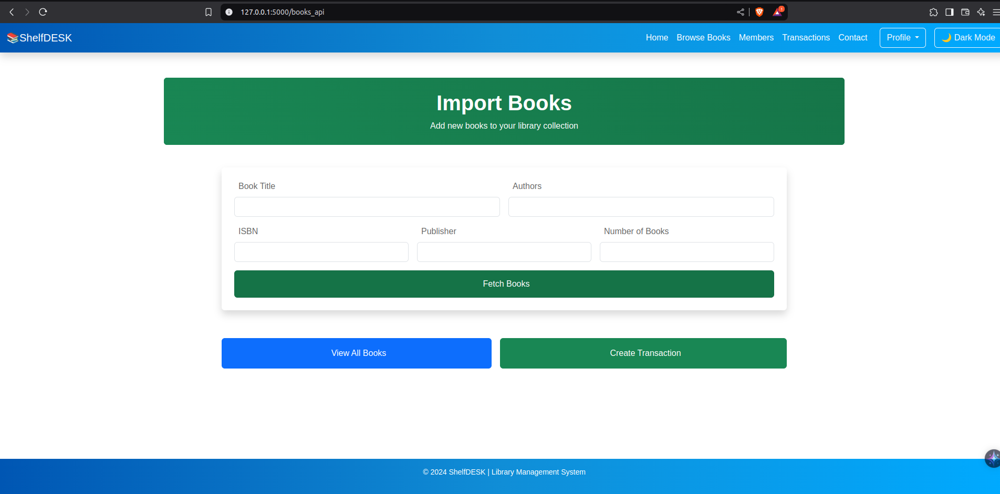
- **Edit Book**: Allows the user to edit the details of an existing book.
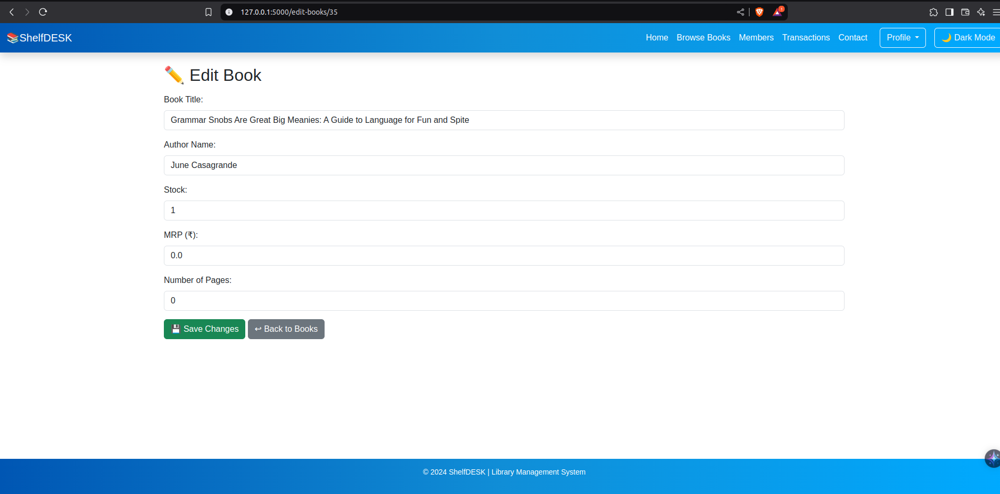
- **Delete Book**: Allows the user to delete a book from the library.

- **View Book Details**: Allows the user to view detailed information about a book.
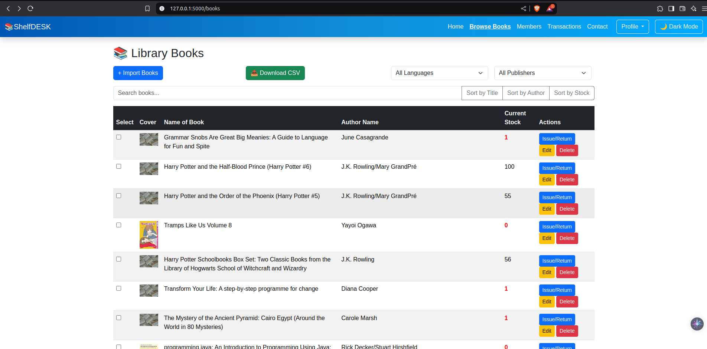

### Members

- **Add Member**: Allows the user to add a new member to the library.
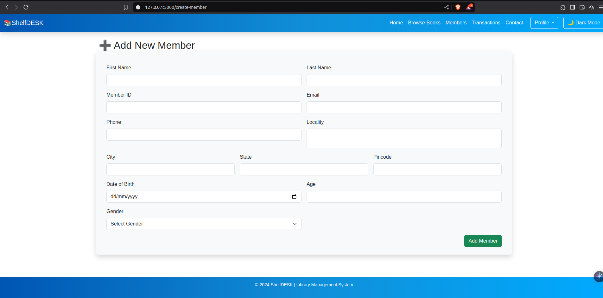
- **Edit Member**: Allows the user to edit the details of an existing member.
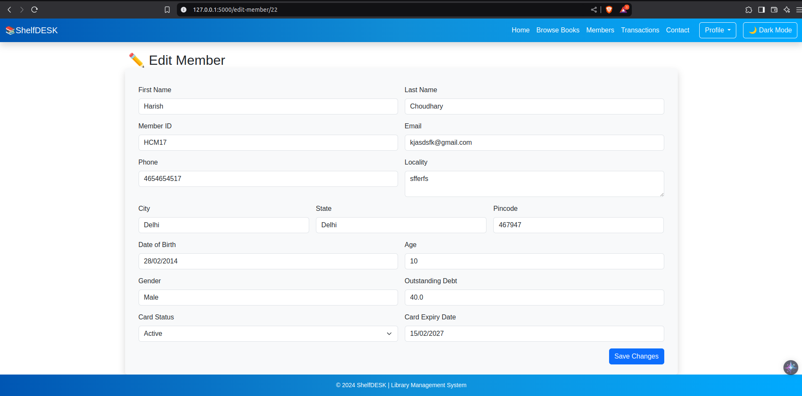
- **Delete Member**: Allows the user to delete a member from the library.

- **Library Card**: Allows the user to print a library card for a member.
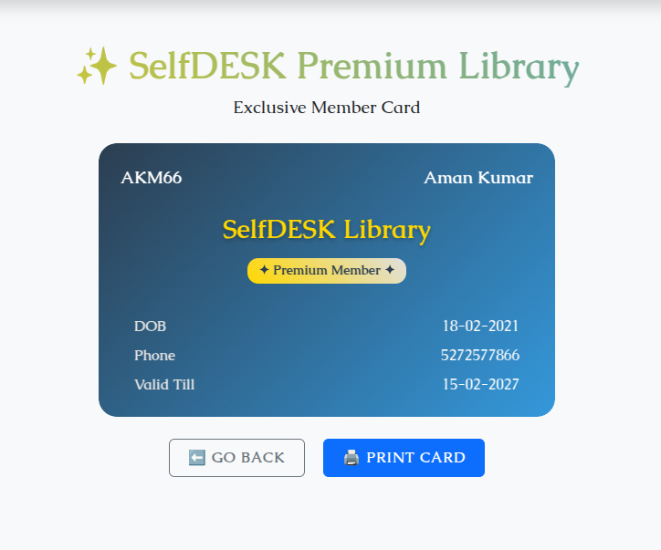
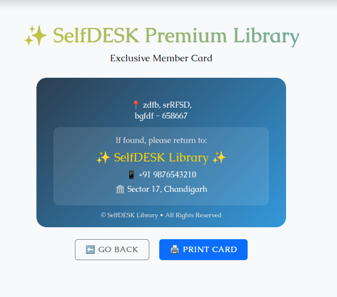

- **Library Card Print**: Allows the user to print a library card for a member.
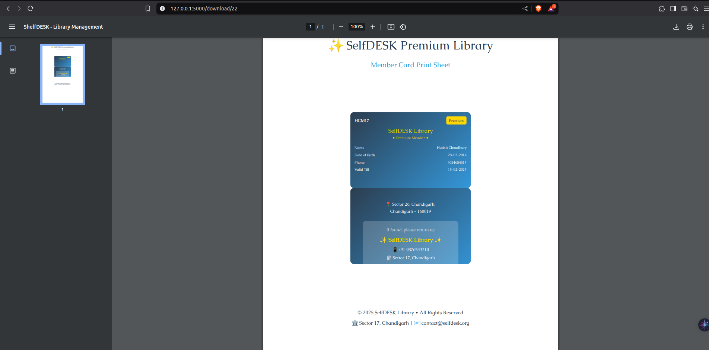

- **View Member Details**: Allows the user to view detailed information about a member.
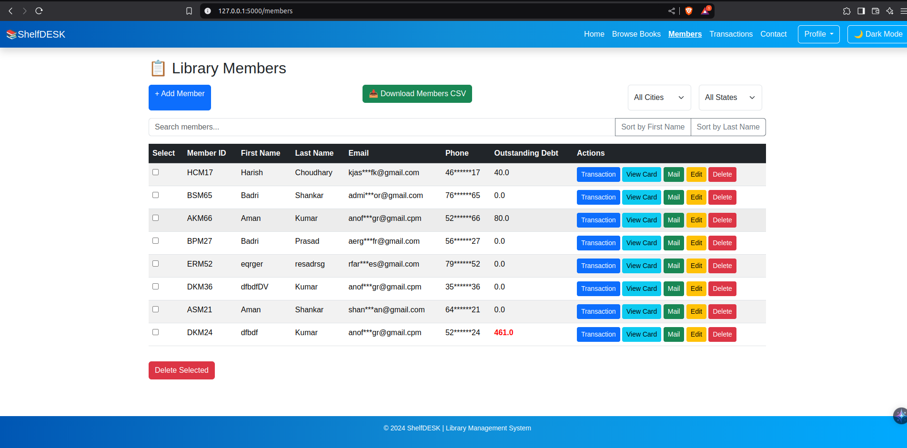

### Transactions

- **Borrow Book**: Allows the user to record the borrowing of a book by a member.
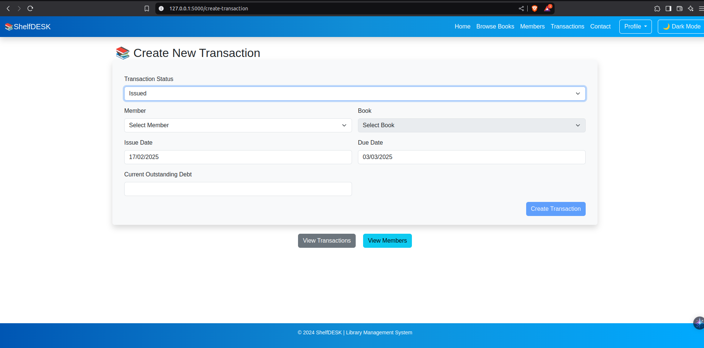
- **Return Book**: Allows the user to record the return of a borrowed book.
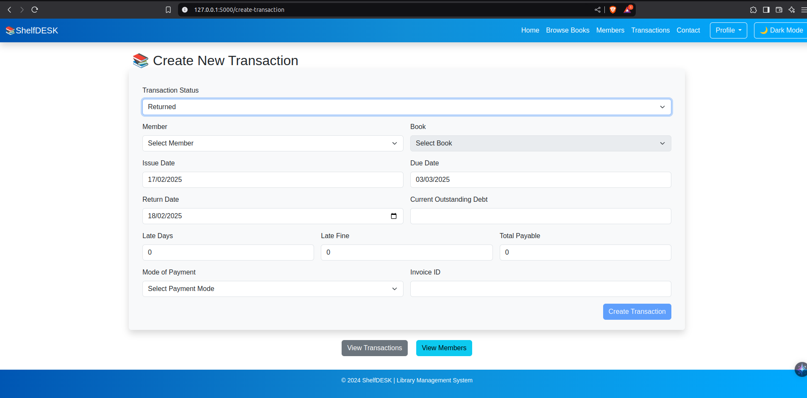
- **View Transactions**: Allows the user to view all transactions, including borrow and return records.
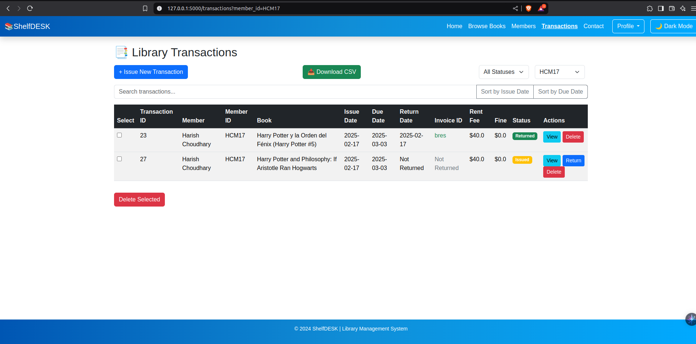
- **Generate Invoice**: Allows the user to generate an invoice for a member showing the books borrowed and their due dates.
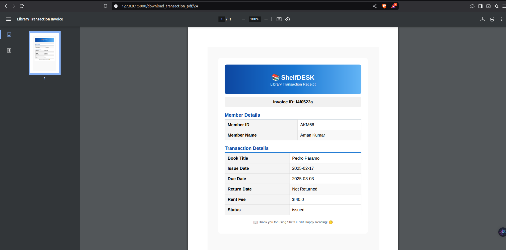
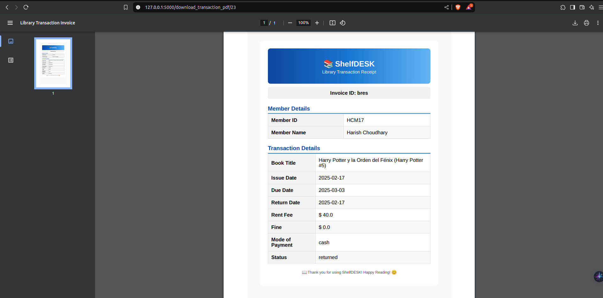

## Future Enhancements 🚀
* **User Authentication:** Implement user authentication and authorization for secure access to the system.
* **Email Notifications:** Send email notifications for overdue books, membership renewal, etc.
* **User Interface Improvements:** Enhance the UI with a modern CSS framework (like Bootstrap) and JavaScript for interactive elements.
* **Advanced Search/Filtering:** Implement more sophisticated search options (e.g., by keyword, publication date).
* **Online Payment Integration:** Allow members to pay membership fees online.
* **Reporting Enhancements:** Generate more detailed reports (e.g., popular books, member activity).
* **Unit Tests:** Add unit tests to ensure code quality and prevent regressions.
* **Multi-language Support:** Add support for multiple languages to cater to a diverse user base.
* **Mobile App:** Develop a mobile application for easier access to the library management system.
* **Integration with External APIs:** Integrate with external book databases to automatically fetch book details.
* **Enhanced Security:** Implement two-factor authentication for added security.

## Contributing

We welcome contributions to ShelfDESK! Whether it's fixing bugs, adding new features, or improving the documentation, feel free to fork the repository and submit a pull request. 

## License

This project is licensed under the MIT License. See the [`LICENSE`](LICENSE ) file for details.